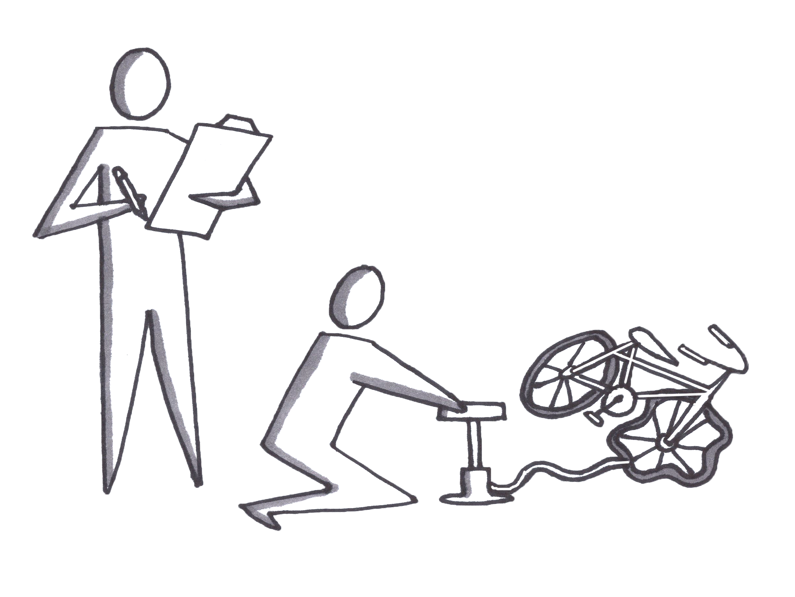

# Contextual Inquiry

## Contextual Inquiry

### In Brief

Contextual inquiry is a combination of semi-structured interviews and observations done in the actual location where the problem occurs or the solution will be used. This method avoids hypothetical statements and helps reveal knowledge that the customer may have but is unaware of and thus unable to communicate in a traditional interview. It may also reveal substitute products, competitors, or workarounds that will help define the optimal solution.

### Helps Answer

* What are the customer’s pain points?
* What are the jobs to be done?
* How often does this problem occur?
* Are there makeshift solutions the customer is currently using?
* Does the customer have any tacit knowledge about the problem space that would help create a solution?

### Tags

* B2C
* B2B
* Qualitative
* Channels
* Value proposition
* Jobs to be done
* Key resources
* Key activities
* Key partners

### Description

#### Time Commitment and Resources

Contextual inquiry can be very expensive depending on the proximity to the customer and the frequency of their problem. In some cases, the problem is unpredictable and a lot of time can be wasted either waiting for the problem to occur or simulating an occurrence.

Expect to spend at least one hour per customer with a minimum of five customers, and two hours to debrief.

It is helpful to have already conducted customer discovery interviews and have both customer personas and a preliminary storyboard of the user experience.

#### How To

**Preparation**

* Arrange the time and place for the interview, making sure it is the time and place where the customer would typically have the problem.
* Prepare a framing statement.

**Conduct the Interview**

* Frame the interview.
* The researcher must establish rapport and put the customer at ease.
* The customer must not feel judged. 
* The researcher is there to learn.
* Establish the rules for observation. 
* The customer will be doing work, so the researcher must establish up-front when they can or cannot interrupt the workflow to ask questions.

**Observation**

* The researcher should take notes on the workflow, asking questions to clarify any points of confusion.
* Take care to note extraneous activities that may be outside the scope of the solution to be designed but may impact the user's workflow, e.g., coworkers engaging in distracting chitchat.

**Summarize**

* Summarize the observations and ask the customer for confirmation.
* Ask any additional clarifying questions.

### Interpreting Results

A number of debriefing methods, such as affinity diagramming, card sorting, or creating jobs to be done can be used after reviewing recordings or notes.

Since the data is primarily qualitative and sample sizes are small, researchers must be careful not to extrapolate a pattern of behavior to the entire population, but they can usually synthesize a clear hypothesis for further evaluative testing methods.

### Potential Biases

* Confirmation bias

### Field Tips

* “Apprentice yourself to the customer and learn how they are currently solving their problems without your product.” _—@TriKro_
* Got a tip? Add a tweetable quote by emailing us: [realbook@kromatic.com](mailto:realbook@kromatic.com)

### Case Studies

* [Lucky Iron Fish: The founder arrived at his solution after he immersed himself in the people he was solving a problem for and studied their culture](https://www.youtube.com/watch?v=M66ZU2PCIcM).
* [Shopping Cart: A perfect example of how you can build better products when you are in contact with customers and build the product in parallel to customer development](https://www.youtube.com/watch?v=M66ZU2PCIcM).
* [Fast Food Milkshake example by Clayton Christensen](https://www.youtube.com/watch?v=f84LymEs67Y)
* Got a case study? Add a link by emailing us: [realbook@kromatic.com](mailto:realbook@kromatic.com)

### Tools

* Got a tool to recommend? Add a link by emailing us: [realbook@kromatic.com](mailto:realbook@kromatic.com)

### References

* [Beyer, H. & Holtzblatt, K. \(1998\). Contextual Design: Defining Customer-Centered Systems. San Francisco, CA: Morgan Kaufmann Publishers. Gaffney, G. \(2004\). Contextual enquiry – A primer.](http://www.sitepoint.com/article/contextual-enquiry-primer)
* [Holtzblatt, K., Wendell, J. B., & Wood, S. \(2005\). Rapid contextual design: A how-to guide to key techniques for user-centered design. San Francisco, CA: Morgan Kaufmann.](https://www.elsevier.com/books/rapid-contextual-design/holtzblatt/978-0-12-354051-5)
* [Rampoldi-Hnilo, L. & English, J.\(2004\). Remote Contextual Inquiry: A Technique to Improve Enterprise Software. Boxes and Arrows.](http://boxesandarrows.com/view/remote_contextual_inquiry_a_technique_to_improve_enterprise_software)
* Whiteside, J. Bennett, J., & Holtzblatt, H. \(1988\). Usability engineering: Our experience and evaluation. In M. Helander \(Ed.\). Handbook of Human-Computer Interaction. New York, NY: Elsevier Science Publishing. 791-817.
* Got a reference? Add a link by emailing us: [realbook@kromatic.com](https://github.com/trikro/the-real-startup-book/tree/6a17bc36666863334ffdefad4f2a9abf3e12ce13/part3-generative_market_research/realbook@kromatic.com)

