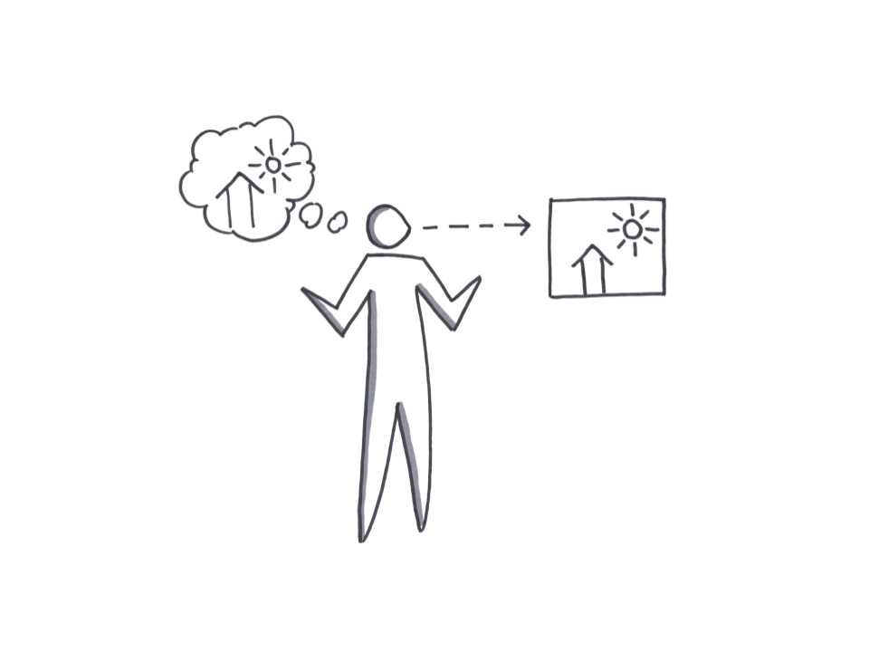

# Comprehension Test

## Comprehension Test

### In Brief

A comprehension test will evaluate whether or not the customer understands the marketing message explaining the value proposition. This eliminates a possible false negative bias on smoke tests where the customer indicates they do not want the value proposition when actually they do not understand it.

### Helps Answer

* Does the customer understand the value proposition?
* How could we explain the value proposition better?

### Tags

* Quantitative
* Qualitative
* Value proposition
* Smoke test

### Description

#### Time Commitment and Resources

* For B2C, it can take 1-2 hours offline or 24 hours online. 
* For B2B, participant recruitment times can vary widely. 
* 10-20 participants.

#### How To

* Write out value proposition in 1-3 sentences.
* Show the value proposition to a participant for a few moments, then remove it.
* Ask them to explain the value proposition in their own words from memory.

#### Interpreting Results

If the participant’s explanation is roughly comparable to our own, we count that as a positive result. If not, then it’s a negative. For this sort of test, we generally want a sample size of about 20 people and a positive conversion of about 80 percent.

The conversion has to be very high because regardless of what our value proposition is, people should understand it.

Take note: if many of the participants use identical language to explain the value proposition back, it should be considered as possible alternative marketing messages.

#### Potential Biases

* Confirmation Bias: **Overly enthusiastic entrepreneurs will sometimes over-explain, correct, or nonverbally prompt the participant with the correct answer.**
* Invalid Target Audience: Participants do not need to be the target customers, but they must have the same level of language and vocabulary as the target customer \(e.g., a junior marketing manager can stand in for a chief marketing officer\).
* False Negative: When using online surveys such as FiveSecondTest, the distractions of an online test can often result in a higher than normal failure rate.

#### Field Tips

* “Run a comprehension test before a landing page test or you won’t understand why it doesn’t work.” @TriKro
* Got a tip? Add a tweetable quote by emailing us: [realbook@kromatic.com](mailto:realbook@kromatic.com)

### Case Studies

* Got a tip? Add a tweetable quote by emailing us: [realbook@kromatic.com](mailto:realbook@kromatic.com)

### Tools

* Got a tool to recommend? Add a link by emailing us: [realbook@kromatic.com](mailto:realbook@kromatic.com)

### References

* [GrasshopperHerder: Comprehension vs. Commitment](https://grasshopperherder.com/comprehension-vs-commitment/)
* [Pearson: Technical Report - Cognitive Labs](http://images.pearsonassessments.com/images/tmrs/tmrs_rg/CognitiveLabs.pdf)
* Got a reference? Add a link by emailing us: [realbook@kromatic.com](https://github.com/trikro/the-real-startup-book/tree/6a17bc36666863334ffdefad4f2a9abf3e12ce13/part4-evaluative_market_experiment/realbook@kromatic.com)

