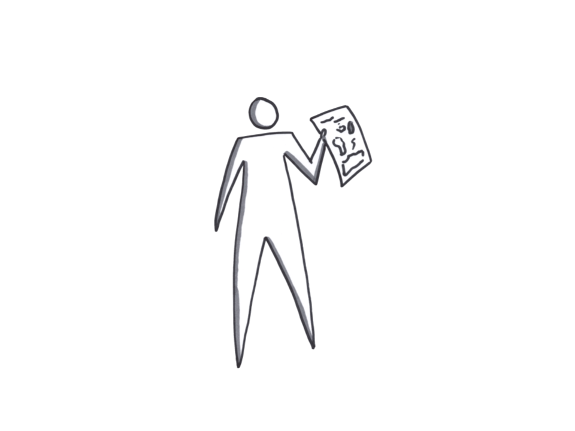

# Flyer Smoke Test

## Flyer Smoke Test

### In Brief

Flyers serve as placeholders for conversations that need to happen. Just like flyers are used to describe existing products, they can also be used to describe product plans. By choosing product benefits, features, and a visualization, you communicate the product vision to the prospect to gauge their reaction. This is a common type of smoke test in enterprise sales.

### Helps Answer

* Will the client agree to an appointment? 
* Does the target prospect respond positively to the flyer?
* Does the target customer pick up the flyer in a normal business context \(conference, lobby, etc.\)?

### Tags

* B2B
* B2C
* Enterprise
* Sales
* Software
* Service

### Description

Flyers are effectively product or service descriptions printed on a graphically attractive piece of stationary. They contain the key message about the product and entice the prospect to take a specific next step, such as arranging an appointment, making a phone inquiry, or visiting a specific URL.

They are most useful as smoke tests for founders or product people in the early stages of a product idea.

In the smoke test scenario, the product does not exist in its full form, so it is possible to test different messaging and value propositions on the flyer.

If you are in a B2B sales scenario, the business relationship is very important. In such markets, there are usually just a handful of heterogenous clients that individually could make a very large purchase. This factor significantly influences the testing process.

#### Time Commitment

* Depends on your design skills and abilities, but likely a few hours
* Or hire a designer to create one
* Distribution: 1-2 days

#### How To

1. Choose a color palette.
2. Determine flyer size.
3. Decide on a distribution strategy.
4. Write a headline that will appeal to the target profile \(in eye-catching font and size\).
5. Add a subtitle that goes into more detail.
6. Add body copy that describes the product/service.
7. Add bullet points.
8. Include a very clear call-to-action that is easy to see.
9. Choose pictures, graphics, or other visualizations to get your point across.
10. Once you are finished designing it, put it up and look at it from a distance \(five meters away or across the room\).
11. Optionally, ask someone else to proofread and give feedback on the flyer.
12. You may want to run a comprehension test of some kind \(to confirm your message is clear\).
13. Print and distribute your flyer.

Tools:

* Canva
* Figma
* Smore.com
* Adobe Illustrator
* MS Publisher
* Designer recruiting sites like 99designs.com, behance.com, etc.

#### Interpreting Results

For a B2C idea, the primary metric that will often be useful is customer acquisition cost \(CAC\).

CAC = Total cost of flyer production/number of conversions \(inquiries\).

For a B2B/enterprise idea, causing some kind of a specific response in your prospect should be the measure. Often this is subjective, as the sales process for a new B2B product tends to be discovered as you are creating it.

#### Potential Biases

* Avoid counting responses of immediate friends and family who aren't in the target market.
* If the customer knows that the product doesn't exist yet, it may bias your results.

#### Field Tips

* "Use insights and language from customer development when crafting your first flyer" @LaunchTomorrow.
* Got a tip? Add a tweetable quote by emailing us: [realbook@kromatic.com](mailto:realbook@kromatic.com)

### Case Studies

* [NextDoor: How the mailbox can be the best way for startups to reach potential users](http://www.inc.com/alex-moazed/how-the-mailbox-can-be-the-best-way-for-startups-to-reach-potential-users.html)
* [Dojo: Heartfelt letters nabbed thousands of downloads and investor interest](http://observer.com/2014/09/forget-pr-emails-app-used-heartfelt-letters-nabbed-thousands-of-downloads-and-investor-interest/)
* [Relatas: Left flyers on every seat in the conference auditorium while it was empty during lunch](https://yourstory.com/2016/10/startup-marketing-watch-out/)
* Got a case study? Add a link by emailing us: [realbook@kromatic.com](mailto:realbook@kromatic.com) 

### Tools

* Got a tool to recommend? Add a link by emailing us: [realbook@kromatic.com](mailto:realbook@kromatic.com)

### References

* [7 Tips for Creating Effective Flyers for Your New Product](http://jodycalkins.com/7-tips-for-creating-effective-flyers-for-your-new-product/)
* [Create Irresistible One Page Sales Flyer](https://www.linkedin.com/pulse/create-irresistible-one-page-sales-flyer-dave-palmer)
* Got a reference? Add a link by emailing us: [realbook@kromatic.com](https://github.com/trikro/the-real-startup-book/tree/6a17bc36666863334ffdefad4f2a9abf3e12ce13/part4-evaluative_market_experiment/realbook@kromatic.com)

