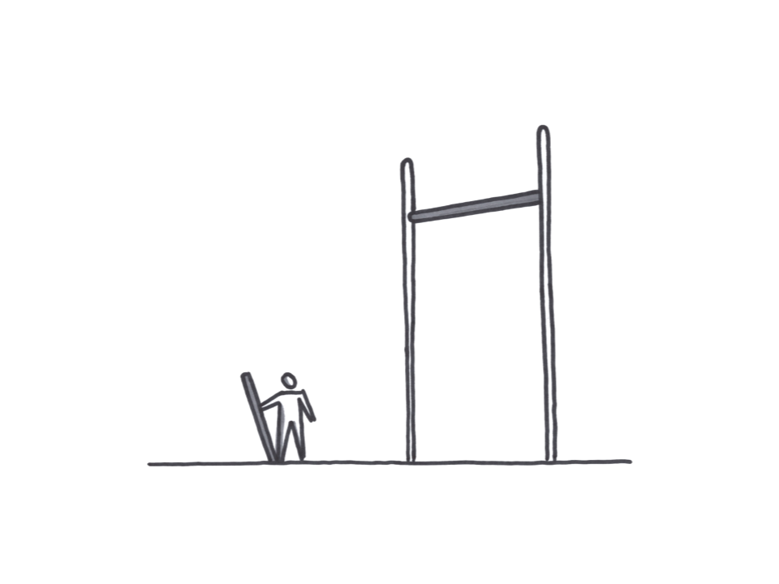

# Value Proposition Test - High Bar

## High Bar Smoke Test

### In Brief

A high bar test helps to gauge the customer’s willingness to pay without using any form of monetary payment. This particular form of smoke test is focused on having the customer go through a set of activities containing abnormal amounts of usability friction \(e.g., a very long, complicated signup form\) to gauge the customer’s desire for a particular solution. This can be combined with additional "pre-qualifying" to ensure that the customers who do take the action are exactly the right kind of customer for the product.

### Helps Answer

* How keen is the customer? 
* How big of a problem is it for the customer? 
* Who is my early adopter?

### Tags

* Purchase motivation
* Nonmonetary
* Behavioral
* Sales 
* B2B
* Quantitative

### Description

A high bar smoke test refers to using an additional behavioral filter to test actual purchasing behavior \(even if you aren't charging money yet\). Basically, you are assuming that a truly motivated customer will jump through any hoops you put in front of them.

This is a particularly useful technique, if:  
1. You aren't yet ready to charge.  
2. You are operating in a B2B environment where the price will be customized to the customer's needs.

It's worth establishing that customers are already "signing up" with a frictionless form of currency. For example, you are gathering a lot of prospect emails. You aren't sure how well this will translate into sales. Your conversion rate to email serves as a benchmark value. Assume you introduce additional steps \(extra form fields, application criteria, additional meetings, and hurdles\). If you continue to get a similar conversion rate, then this high bar is reached. The smoke test passes.

This technique corresponds with "lead scoring" in a B2B context. In short, you can prioritize the relevance of incoming sales leads based on their interactions with you. Usually, the three main criteria used include RFM \(recency, frequency, and money\). A prospect with recent interactions is more likely to buy from you. A prospect who's frequently "touched" you, i.e., opened emails, attended meetings, or fielded calls, is more likely to buy. A prospect who's already spent money elsewhere to solve the problem \(or with you\) are more likely to buy from you. This is already implemented in various CRM and email software packages.

An early stage B2B startup can run a high bar smoke test, which if passed can also serve to prescreen incoming leads. The more robust data collection process helps them prioritize future sales opportunities.

Ultimately, what matters is sales. This test helps provide a proxy for sales if it is not practical or possible to immediately sell. Even if your signup conversion rate falls, this might not proportionally impact your actual sales. If you weed out prospects for whom your product is irrelevant, this will not impact your sales.

#### Time Commitment and Resources

Online: A few hours to a few days of developer time for a simple approach  
Existing packages: Integration time  
Offline: Depends on your existing approach/processes, and what you want to learn

#### How to

1. Determine what else you want to know about your target market and in what time frame \(timebox\).
2. Determine the current conversion rate on your existing signup process.
   * Make it clear exactly how this is calculated, i.e., what constitutes a conversion event, particularly if you are doing it manually.
   * Also be clear on the ideal prospect, i.e., your near-miss prospects don't count if they fill out the form.
3. Add some "friction" to the process in the form of additional form fields, or introduce an application process.
   * If you have enough traffic, you can try to set this up as an A/B split test.
4. Once the timebox expires, compare your conversion rate. 

#### Interpreting Results

* This type of smoke test requires a lot of self-awareness and accountability, even compared to other smoke tests. If you get an unexpected result, there is a temptation to question your previous assumptions.
* As with all smoke tests, do not ask about future behavior.

#### Potential Biases

* Ambiguity: Even more so than with other test types, it is critical to be clear up front what "counts" and what doesn't. 
* Backfire effect: The reaction to disconfirming evidence by strengthening one's previous beliefs.

#### Field Tips

* Agree what constitutes a conversion event before you do a high bar smoke test.
* Your near-miss prospects don't count if they fill out your signup form when doing a high bar smoke test.
* Got a tip? Add a tweetable quote by emailing us: [realbook@kromatic.com](mailto:realbook@kromatic.com)

### Case Studies

* [Marketing Experiments: Lead Generation - Testing form field length reduces cost-per-lead by $10.66](http://www.marketingexperiments.com/blog/internet-marketing-strategy/lead-generation-testing-form-field-length-reduces-cost-per-lead-by-10-66.html)
* Got a case study? Add a link by emailing us: [realbook@kromatic.com](mailto:realbook@kromatic.com)

### Tools

* [12 Tools That’ll Help You Build a High Converting Landing Page](https://neilpatel.com/blog/12-tools-that-can-help-you-build-high-converting-landing-pages/)
* [VentureHarbour: 21 Best Landing Page Builders in 2](https://www.ventureharbour.com/best-landing-page-builders/)
* [Zapier: The 11 Best Online Survey Apps in 2019](https://zapier.com/learn/forms-surveys/best-survey-apps/)
* Got a tool to recommend? Add a link by emailing us: [realbook@kromatic.com](mailto:realbook@kromatic.com)

### References

* [Hubspot: RFM \(Recency, Frequency, Monetary Value\), Explained in 600 Words or Less](https://blog.hubspot.com/service/rfm-analysis)
* [Moves the Needle: Lean Experiment Techniques](https://www.movestheneedle.com/all-blog/2016/6/14/enterprise-lean-startup-experiment-examples)
* [Smashing Magazine: Designing Friction For A Better User Experience](https://www.smashingmagazine.com/2018/01/friction-ux-design-tool/)
* Got a reference? Add a link by emailing us: [realbook@kromatic.com](mailto:realbook@kromatic.com)

