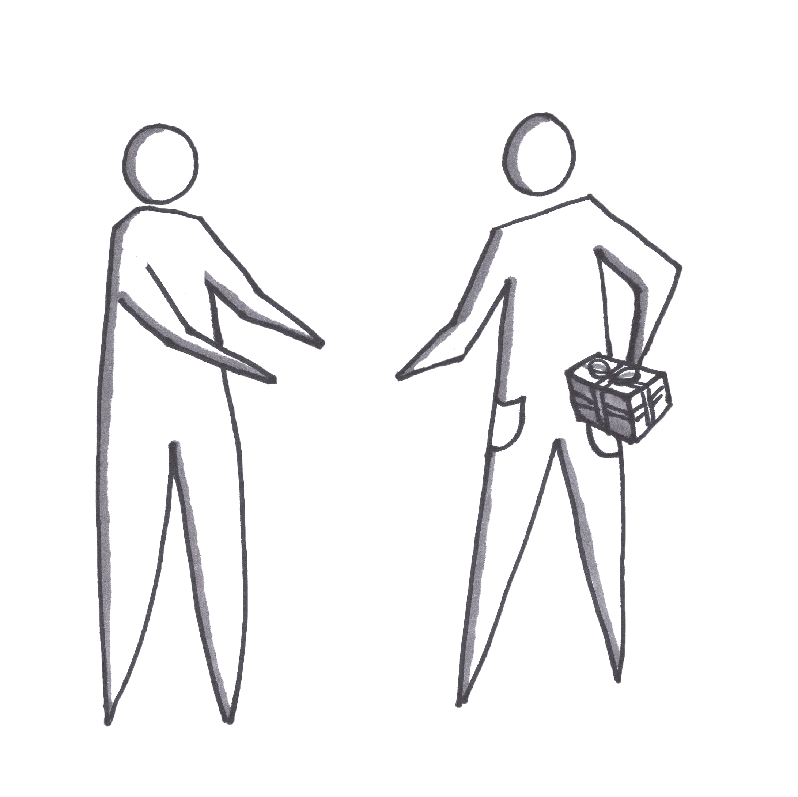

# Pocket Value Proposition Test \(Smoke Test\)

## Pocket Smoke Test

### In Brief

This smoke test applies to physical goods or products with hardware components — at minimum a mobile phone. It entails interviewing a prospect or customer, then physically pulling a prototype out of our pocket and using the prototype to drive further discussion and exploration.

### Helps Answer

* Am I building the right product?
* Does the product have the right features or characteristics, relative to the value proposition?
* Does the user understand the product and its structure/architecture?
* How does the user expect to interact with the solution?
* Does the user understand how to achieve their goals using the product prototype?
* What constraints does the user have? 

### Tags

* Solution
* Design
* Value proposition

### Description

This type of smoke test helps validate whether the type of solution is appropriate for the problem you want to solve. It's meant to start a discussion. You can lead with a number of questions, particularly to confirm the problem\(s\) you want to address.

By showing a specific solution to a voiced problem, you can go in much greater depth with questions. You can also observe how the user expects to use the product.

This is a smoke test. Treat the prototype as a conversation piece. You are focusing on the main "happy case." Is it something users want? Could it believably address their problem? It's fine for a prototype to be ugly, as long as you use it to learn something you didn't already know.

#### Time Commitment and Resources

Varies significantly on the actual product. On the low end, it's easy to use mobile phone mockup software to show the average person on the street a mobile phone app prototype. This takes a few hours in the hands of a decent designer using software like InVision or Prototyping on Paper \(POP\). You can create a simulated version using simple materials like wood and plastic, to discuss form factors for instance. On the high end, it might take a lot of time to design and source custom parts to build a prototype that addresses a specific pain point.

#### How to

1. Roughly sketch how the product should look. This can be very simple or a full electronics blueprint. 
2. Build or assemble the product \(manually, 3d printing, Arduinos and Raspberry Pis, sensors, breadboards, etc.\).
3. Show it to prequalified customers who have the problem you want to address.

#### Interpreting Results

Ask lots of questions about what the user would find valuable. Hone in on how your prototype differs from how they currently solve their problem\(s\).

#### Potential Biases

You don't need to be able to mass produce the prototype to run this smoke test. Scaling requires a different set of tests. Also you don't need to be overly concerned about production costs and revenue at this stage. You just want to get an idea of user expectations.

#### Field Tips

* Got a tip? Add a tweetable quote by emailing us: [realbook@kromatic.com](mailto:realbook@kromatic.com)

### Case Studies

* Got a case study? Add a link by emailing us: [realbook@kromatic.com](mailto:realbook@kromatic.com) 

### Tools

* Got a tool to recommend? Add a link by emailing us: [realbook@kromatic.com](mailto:realbook@kromatic.com)

### References

* [Eduardas Afanasjevas - A guide to building a hardware prototype ](https://medium.com/london-tech-startups/a-guide-to-building-a-hardware-prototype-df449e002f06#.v1huqveix)
* [Ben Einstein - The Illustrated Guide to Product Deveopment](https://blog.bolt.io/the-illustrated-guide-to-product-development-part-2-design-ab69efb8084a#.opf01fro8) \(A good framework for hardware design in a Lean Startup context\)
* [https://www.hwtrek.com/](https://www.hwtrek.com/) \(A global, open-source platform for hardware\)
* Got a reference? Add a link by emailing us: [realbook@kromatic.com](https://github.com/trikro/the-real-startup-book/tree/6a17bc36666863334ffdefad4f2a9abf3e12ce13/part4-evaluative_market_experiment/realbook@kromatic.com)

