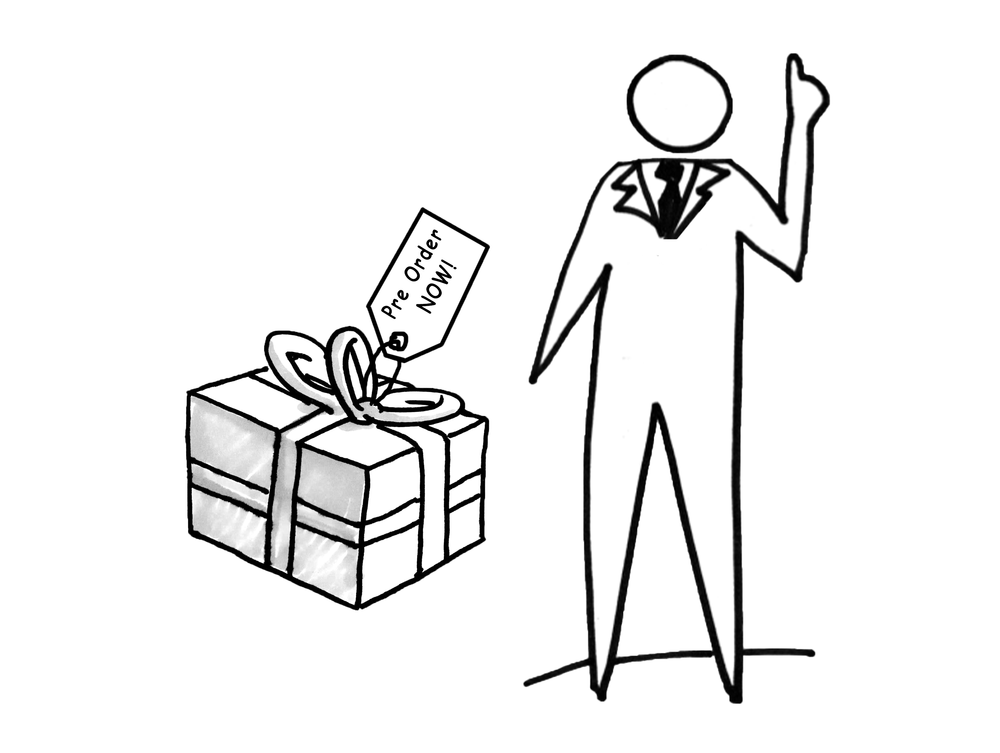

# Pre-Sales Smoke Test

## Pre-Sales Smoke Test

### In Brief

Pre-sales involves accepting payment in exchange for a promise to deliver the value proposition at a later date. Usually, the value proposition is the product or service itself. This is a highly committed form of smoke testing because it requires actually collecting money from the customer and usually carries a very strong implicit \(if not legal\) promise to deliver the product or service at a later date. Pre-sales are also known as pre-orders, vaporware, or vaporgoods.

Does the prospect know your product does not yet exist? If not, the pre-sales campaign can be considered a true smoke test and will have different dynamics and results than if the prospect is aware of this fact.

Most, but not all, crowdfunding campaigns are in fact pre-sales campaigns. Pre-sales campaigns can also rely on online platforms built from scratch, or on platforms like Celery.

The MVP for the pre-sales campaign can include a description of the value proposition, product renderings, mock-ups, simulations, a promotional video, customer testimonials, and so on.

### Helps Answer

Is the customer actually willing to pay money for the value proposition?

### Tags

* Quantitative validation
* Benchmarking
* Positioning
* Value proposition
* Audience selection strategy
* Investor attraction

### Description

#### Time Commitment

One week to 90 days. Most successful crowdfunding pre-sales campaigns involve 30 days of pre-promotion and a 40-day campaign duration \(70 days total\).

#### How To

* Create your MVP \(renderings or simulations, promotional media, pricing, testimonials, etc.\).
* Establish your pre-sales ecommerce platform.
* Promote and launch your campaign.
* Measure results \(conversions and total orders\).

#### Interpreting Results

...

#### Potential Biases

* Confirmation Bias
* Invalid Target Audience
* False Negative

#### Field Tips

* Got a tip? Add a tweetable quote by emailing us: [realbook@kromatic.com](mailto:realbook@kromatic.com)

### Case Studies

* [Soma water filters](http://tim.blog/2012/12/18/hacking-kickstarter-how-to-raise-100000-in-10-days-includes-successful-templates-e-mails-etc/)
* [Coin](http://techcrunch.com/2013/11/14/coin-the-electronic-credit-card-reaches-its-pre-order-goal-in-40-minutes/)
* [ElasticSales and Close.io](https://www.linkedin.com/pulse/20140423214327-7006635-how-to-charge-money-for-things-that-don-t-exist-yet)
* [My Sky](https://thefoundation.com/podcast/episode25)
* [MixedMade](http://bushwickkitchen.com/blogs/startup-journey/12362041-selling-a-product-that-doesnt-exist-day-22)

#### Field Tips

* Got a tip? Add a tweetable quote by emailing us: [realbook@kromatic.com](mailto:realbook@kromatic.com)

### Case Studies

* [TechCrunch: Jolla Closes Pre-Sales Campaign For Its First Phone](http://techcrunch.com/2013/08/21/jolla-closes-first-pre-sales/)
* Got a case study? Add a link by emailing us: [realbook@kromatic.com](mailto:realbook@kromatic.com) 

### Tools

* Got a tool to recommend? Add a link by emailing us: [realbook@kromatic.com](mailto:realbook@kromatic.com)

### References

* [Indiegogo](https://www.indiegogo.com/#/picks_for_you)
* [Kickstarter](https://www.kickstarter.com)
* [Kickstarter Prohibits Product Simulations and Photorealistic Product Renderings](https://www.kickstarter.com/blog/kickstarter-is-not-a-store?page=2)
* [Celery: Pre-sales platform](https://www.trycelery.com)
* [Celery Blog: Successful DIY Pre-Order Crowdfunding Campaigns Revealed](http://blog.trycelery.com/successful-preorder-website-campaigns/)
* [Harvard Business Review: Sell Your Product Before It Exists](https://hbr.org/2013/12/sell-your-product-before-it-exists)
* [The 5-Step Formula for Effectively Pre-Selling Your Product to Your Audience](https://yourfirstcustomers.com/the-5-step-formula-for-effectively-pre-selling-your-product-to-your-audience/)
* Got a reference? Add a link by emailing us: [realbook@kromatic.com](https://github.com/trikro/the-real-startup-book/tree/6a17bc36666863334ffdefad4f2a9abf3e12ce13/part4-evaluative_market_experiment/realbook@kromatic.com)

