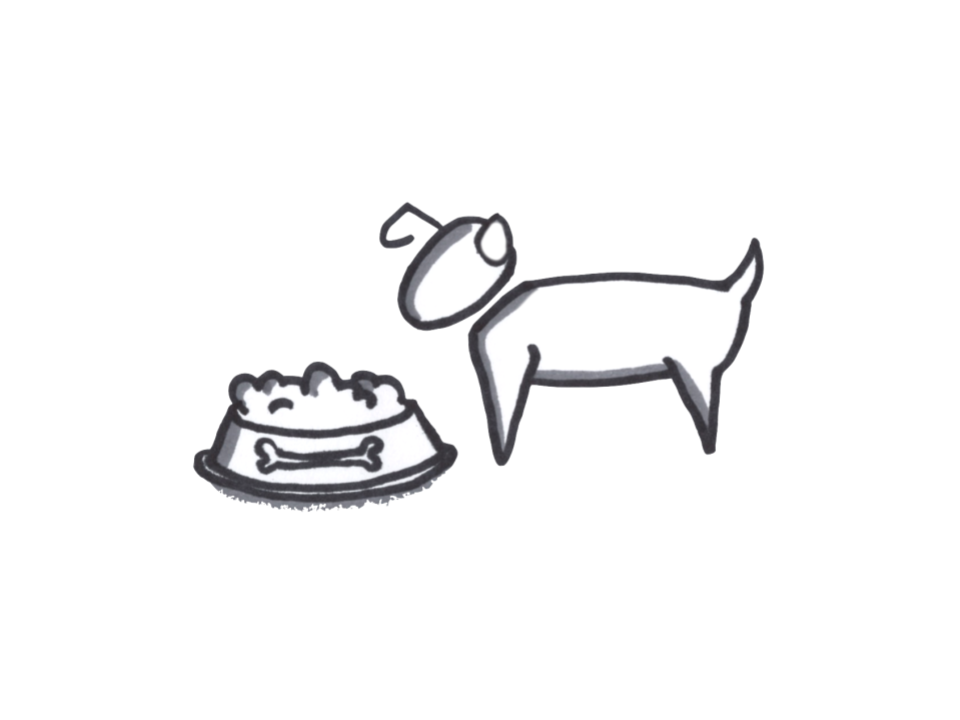

# Dogfooding

## Dogfooding

### Summary

Dogfooding is simply using the product as if one was the customer and experiencing it firsthand. It is a common practice but is an unstructured methodology as there is no script outside of using the product in the use case it was designed for.

### Helps Answer

* Will the solution provide the value proposition?
* Is the solution working right?
* What is the minimum viable feature set?

### Tags

* Value proposition
* Solution
* Generative product research

### Description

Using one’s own product is a standard practice among many technology startups and entrepreneurs. In many cases, entrepreneurs are building a product to solve their own pain points, so it is common to then use the product.

There is no predefined script for dogfooding and it is not a formal quality assurance \(QA\) process. The main advantage to this method is it may reveal unorthodox use cases that were not covered in the requirements or QA tests. Therefore, dogfooding should primarily be considered generative research and not an experiment.

Companies that do not use their own products and services are sometimes criticized, [in some cases very publically](https://www.cnet.com/news/googles-eric-schmidt-why-i-love-my-blackberry/).

Time Commitment and Resources If team members regularly encounter the use case of the product, then there is no time commitment or resources necessary aside from having a notebook and writing down the results.

However, if the use case is infrequent or complex \(such as for booking and taking a vacation using AirBnB\) then dogfooding can imply a substantial use of time.

### How To

#### Preparation

Make sure you have a place to take notes that is easily accessible and won’t interrupt your workflow too much.

#### Research

Simply use the product in your day-to-day work. Take notes whenever something works surprisingly well or fails to live up to expectations. Record any additional insights or ideas that occur while using the product. Note any time when the workflow is interrupted or another service is needed to finish the task.

#### Debriefing and Interpreting Results

Be careful to interpret the results as generative and not evaluative. The makers of a product have an intimate knowledge of the product design and likely cannot capture the uneducated user’s perspective.

This is especially true in dogfooding the new user process, where the makers of the product have a massive amount of prior information and expectations regarding the signup and onboarding process.

Completely missing edge cases is also particularly common, especially if the team is not particularly diverse. For example, a team may not analyze the product for use by handicapped or minority users and thus overlook substantial aspects of its user experience. This can be more of a problem as a product scales beyond an initial niche audience.

When multiple team members dogfood their product, notes can be collected and sorted via card sorting, stack ranking, or other standard UX methods.

#### Potential Biases

* Confirmation Bias

  Creators of a product can subconsciously avoid situations and use cases they know are incomplete or buggy, leaving a positive impression that the product works according to the specification, even if it has serious flaws in ordinary usage.

#### Field Tips

“Dogfooding only works when your team is as diverse as your customer base.” - @TriKro

* Got a tip? Add a tweetable quote by emailing us: [realbook@kromatic.com](mailto:realbook@kromatic.com)

### Case Studies

* [Dogfooding at Bitglass: We Secure Our Own Corporate Data](http://www.bitglass.com/blog/dogfooding-at-bitglass-we-secure-our-own-corporate-data)
* [Cnet: Google's Eric Schmidt: Why I love my BlackBerry](https://www.cnet.com/news/googles-eric-schmidt-why-i-love-my-blackberry/)
* [ALPHABET EXEC ERIC SCHMIDT USES AN IPHONE, BUT THINKS THE GALAXY S7 IS BETTER](http://www.digitaltrends.com/mobile/eric-schmidt-iphone-use/)
* Got a case study? Add a link by emailing us: [realbook@kromatic.com](mailto:realbook@kromatic.com) 

### Tools

* Got a tool to recommend? Add a link by emailing us: [realbook@kromatic.com](mailto:realbook@kromatic.com)

### References

* [Intercom: The Danger of Dogfooding](https://blog.intercom.com/the-danger-of-dogfooding/)
* [Forbes: Not Eating Your Own Dog Food? You Probably Should Be](http://www.forbes.com/sites/michaeldefranco/2014/03/04/not-eating-your-own-dog-food-you-probably-should-be-2/#6d2f7ad51d6e)
* Got a reference? Add a link by emailing us: [realbook@kromatic.com](https://github.com/trikro/the-real-startup-book/tree/6a17bc36666863334ffdefad4f2a9abf3e12ce13/part5-generative_product_research/realbook@kromatic.com)

