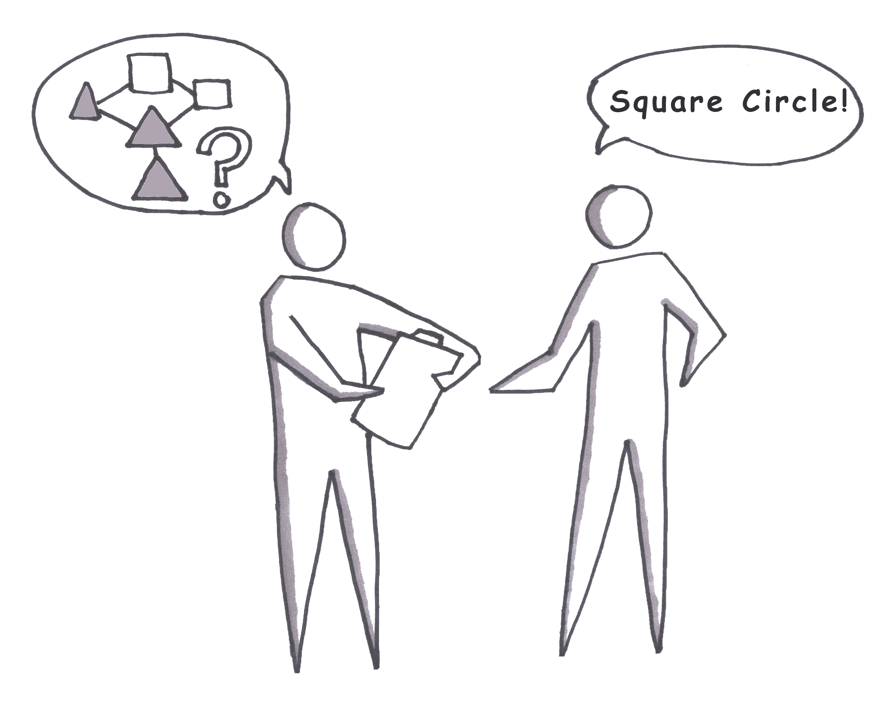

# Solution Interview

## Solution Interview

### In Brief

The solution interview builds on our research around the problem and proposes a solution to see how potential customers react. Solution interviews result in qualitative feedback from users or prospects about the product when presented with the product or a prototype. Use a “demo” to help customers understand the solution and confirm that it will solve their problem.

### Helps Answer

* What is the minimum feature set needed to launch?
* What are "must have" features/benefits for the user?
* Will the solution "work"?
* Where are the solution’s strengths and weaknesses?
* Is the copy/presentation right?
* Why is the price right/not right relative to alternative ways of addressing the problem?
* How do I create the groundwork for repeat sales?
* How does the product fit into the prospects' existing technology mix \(for B2B tech especially\)

### Tags

* Qualitative
* Demo
* Visualization
* Price
* Features

### Description

The biggest risk product entrepreneurs face is that they’ll create a product that absolutely no one wants to buy. Problem interviews help identify common problems within a particular market segment. When you have identified a clear problem, solution interviews help nail down the reasons why or whether a particular product "works" for your early adopters.

Often solution interviews are performed with some kind of a proxy for a product, created to spark a conversation with the prospect or customer. According to @ashmaurya, "You want to build enough of the solution \(or a proxy, like screenshots, a prototype, etc.\) that you can put in front of customers for the purpose of measuring their reaction and further defining the requirements for your minimum viable product \(MVP\).”

The primary goals of solution interviews are to:

* Define the minimum features needed to solve a previously identified problem.
* Have a found price the customer is willing to pay \(to check that you can build a business around it\).

For smaller dollar-value products, you may want to perform some kind of a smoke test instead. A solution interview is a useful way to prepare a smoke test or to understand why a smoke test didn't pass your research hypothesis.

For a larger dollar-value product, the solution interview may feel like a consultative sale, but it's primarily a research tool to help adjust or customize a product to real customer needs.

Like other types of customer interviews, solution interviews are best done in pairs. One person takes notes during the interview. The other actually asks the questions and focuses on building rapport with the user.

#### Time Commitment and Resources

This is similar to initial customer discovery/problem interviews:

* Rounds of interviews to test one hypothesis can range from 5 to 100 interviews. 
* Actual interviews last anywhere from 5 minutes for consumer products tested using "man on the street" interviews, to 2 hours for detailed B2B requirements gathering. 
* Time costs can be significant in terms of recruiting appropriate interviewees, particularly ones who currently have the problem you want to solve and who are in the target segment.
* Financial costs: Depending on context, you can offer gift certificates or a symbolic gift if you feel it's appropriate \(such as in a B2B scenario\).

#### How to

Determine what you want to learn before conducting interviews and formulate a research hypothesis.

1. Greet the user/prospect.
2. Confirm that they fit all of your criteria and that they have the problem you currently want to solve.
3. Set the problem context by telling a story.
4. Reflect/reconfirm the problem back to the customer.
5. Propose/demo a specific solution.
6. Optionally discuss pricing, particularly relative to alternative products.
7. Ask "what do you need to do to make progress?"
8. Get permission to follow up and/or for referrals.
9. Document your results, ideally on a small A6 notepad that fits in your pocket if you are out on the street.

#### Interpreting Results

Use the solution interview to plan the initial feature set of your product and determine pricing strategy.

#### Potential Biases

* Leading questions such as “Do you usually add products to the cart or use the one-click-purchase?” miss the opportunity to actually learn how the user uses Amazon.
* Allow the user to tell you what they think the product does and what it could do. 
* Give the user something to react to, rather than making them imagine how the product makes them feel.
* Be certain you are interviewing the right user, someone who is currently seeking out a product like the one you are making. 

#### Field Tips

* "Forget all about the art of Pitching, you want the art of Dialogue." - @Justin\_Wilcox
* "Don’t ask users to imagine a feature." - @DaisyHappy2014
* "Allow the user to tell you what she thinks the product does and what it could do for her." - @LauraKlein
* Got a tip? Add a tweetable quote by emailing us: [realbook@kromatic.com](mailto:realbook@kromatic.com)

### Case Studies

* Got a case study? Add a link by emailing us: [realbook@kromatic.com](mailto:realbook@kromatic.com) 

### Tools

* Got a tool to recommend? Add a link by emailing us: [realbook@kromatic.com](mailto:realbook@kromatic.com)

### References

* [Apply the Lean Startup in B2B to Build Products Businesses Want: Solution Interviews](https://www.slideshare.net/egarbugli/apply-the-lean-startup-in-b2b-to-build-products-businesses-want-course-slides/140-27Pivots)
* [The Sales Pitch is Dead. Long Live Solution Interviews!](http://customerdevlabs.com/2014/08/05/problem-solution-interviews-b2b-sales-pitch/)
* [LeanSteps: Solution Interviews](https://leansteps.wordpress.com/11-2/step-3-lean-experiment/solution-interviews/)
* Got a reference? Add a link by emailing us: [realbook@kromatic.com](https://github.com/trikro/the-real-startup-book/tree/6a17bc36666863334ffdefad4f2a9abf3e12ce13/part5-generative_product_research/realbook@kromatic.com)

