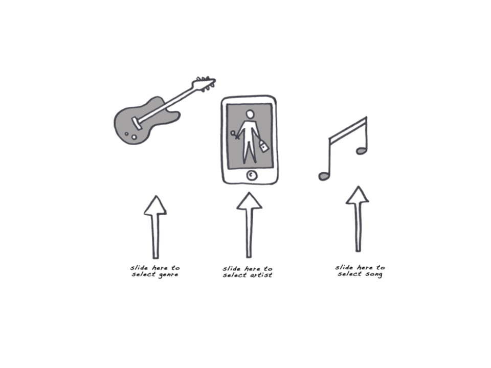

# Paper Prototyping

## Paper Prototyping

### In Brief

Quickly test a solution idea by simulating user-product interactions using paper drawings and cutouts. Paper prototyping is often a form of usability testing, although it can also be used to help generate and evaluate design alternatives during ideation.

One person plays the role of product user while others simulate the behavior of the product in response to the user’s actions using paper mock-ups of screen images or other user-interface elements.

### Helps Answer

* What basic form\(s\) might our solution take?
* Where are there usability issues in our solution concept?
* Is our solution intuitive for our customer to use/navigate?
* Are there other use cases or error conditions we didn’t think of?
* What pieces of information do we need to provide to our customers?

### Tags

* B2C
* Qualitative

### Description

#### Time Commitment

Anywhere from a few minutes to several days. As a formal usability-testing approach, more time may be needed to allow for advance planning of time with customers and more complex preparation of mockups and planning of scenarios. Alternatively, can be used in the moment as part of generative design work with very little prep in the time it takes a to produce a few rough sketches to help quickly visualize a concept and test it for weaknesses.

#### How to

1. For each screen/interface that is part of the interaction you are testing, create a simple mockup on paper illustrating what will appear on the screen for the various scenarios you are exploring.
2. One person \(or a pair\) plays the role of the customer/end user \(customer\).
3. Another person \(or several people\) plays the role of the software \(computer\).
4. The customer interacts with the paper prototype as if it is a “real” application, physically interacting with the paper interface just as they would the real thing. They are encouraged to explain their thinking out loud as much as possible.
5. For each action the customer takes, the computer then moves/updates the paper prototype to reflect the new state in response to the customer’s action. As a general rule, the computer should not talk.
6. For more formal forms, observers would typically watch for additional insights and capture notes. A facilitator may also be desired, as they can encourage the customer to ask questions and think aloud.
7. Alternate interaction flows and layouts, and/or modifications to proposed interactions can be quickly mocked up and tested if changes are desired.

#### Interpreting Results

You are looking for places where the customer got stuck, was not able to find what they were looking for, or accidentally went down the wrong path. Anything that is misleading, confusing, or hard-to-find is noteworthy. For items like this, dig into what information the customer was missing that led to the confusion and how that information might be provided \(or how might the need for it be eliminated\). You can look for situations that may have come up where the response by the computer was not defined, or where an action was possible that you did not want to be possible. Also consider revisiting assumptions about your customers’ motivations or the knowledge and experience base they bring — the test may reveal incorrect assumptions and provide insight for improving your solution.

#### Potential Biases

* Confirmation bias is possible, especially if a facilitator or other participant knowledgeable about the software provides too many “hints” to the customer. 
* Can miss more fine-grained usability issues such as those relating to placement, size, scrolling, mouse/keyboard interactions, and more. Digital tools may be more appropriate for this level of detailed usability testing. 
* Customers may hide feedback if they are concerned about appearing incompetent or offending others.
* If the user performing the test is more experienced, you may miss issues that a less savvy user would have revealed. 

#### Field Tips

* Got a tip? Add a tweetable quote by emailing us: [realbook@kromatic.com](mailto:realbook@kromatic.com)

### Case Studies

* [NN Group: Mozilla Paper Prototype](http://www.nngroup.com/articles/mozilla-paper-prototype/)  
* [Interaction Design: Paper Prototyping as a Core Tool in the Design of Mobile Phone User Interfaces](http://www.id-book.com/secondedition/casestudy_11-2_paper2.htm)
* Got a case study? Add a link by emailing us: [realbook@kromatic.com](mailto:realbook@kromatic.com) 

### Tools

* Got a tool to recommend? Add a link by emailing us: [realbook@kromatic.com](mailto:realbook@kromatic.com)

### References

* [Carolyn Snyder, Paper Prototying. Morgan Kaufmann, 2003.](http://www.paperprototyping.com/)
* [Dumas, Joseph and Janice Redish, A Practical Guide to Usability Testing. Intellect, Ltd, 1999.](https://www.amazon.com/Practical-Guide-Usability-Testing/dp/1841500208)
* [IBM: Sure, It's Low-Tech, but This Usability Testing Method Can Help You Sidestep Problems before You Write Your Code](http://www.csee.umbc.edu/courses/undergraduate/345/spring12/mitchell/readings/paperPrototyping_Snyder.pdf)
* [User Focus: 7 Myths about Paper Prototyping](http://www.userfocus.co.uk/articles/paperprototyping.html)
* [SpeckyBoy: Effective Video Examples of Paper Prototyping](http://speckyboy.com/2010/06/24/10-effective-video-examples-of-paper-prototyping/)
* [NN Group: Paper Prototyping: Getting User Data before You Code](http://www.nngroup.com/articles/paper-prototyping/)
* [Atlassian Blog: Usability Testing with Paper Prototyping](http://blogs.atlassian.com/2011/11/usability-testing-with-paper-prototyping/)
* Got a reference? Add a link by emailing us: [realbook@kromatic.com](https://github.com/trikro/the-real-startup-book/tree/6a17bc36666863334ffdefad4f2a9abf3e12ce13/part6-evaluative_product_experiment/realbook@kromatic.com)

