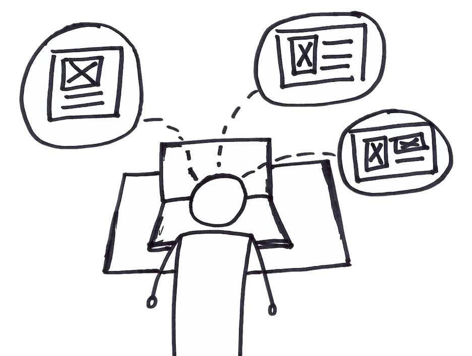

# Usability Testing

## Usability Testing

### In Brief

Usability testing involves observing people trying to complete a series of tasks while using an interactive product. The product can be any level of fidelity from a paper mockup to a fully functioning product. Users are asked to perform tasks, and the observer records whether the user is able to complete them and their level of confusion or frustration during the process.

### Helps Answer

* How do people use the product or service?
* Do people understand how to use the product or service \(as intended\)?
* What do people experience at different touchpoints while using the product or service?

### Tags

* Qualitative
* Value proposition
* Customers
* Description

### Time Commitment and Resources

Usability tests with five users can be finished in half of a working day with minimal resources. Tests typically require no more than five to seven users, unless the tasks are complex and involve several parties collaborating simultaneously to complete the test. Tests are often performed with extensive equipment, including full usability labs with cameras, eye tracking software, and one-way mirrors. However, this is not strictly necessary.

#### How To

1. Prepare: Preparation is critical for usability testing since the test produces a number of potential biases in interpreting the qualitative results. At the minimum, the experimenter should have:
   * Introduction script
   * List of use cases and tasks
   * Context of the task \(e.g., “You are thinking of buying a car.”\)
   * Description of task \(e.g., “You would like to compare prices of various cars.”\)
   * Reasonable time limit for each task
   * Recording equipment such as a notebook or a camera
   * Usability tests can be performed in any environment. In some cases, a usability lab with no distractions may be very different from the environment where the product will actually be used. A real environment such as a workspace or coffee shop may provide more accurate real world behavior but may make detailed observations difficult or impossible. A usability lab allows for detailed observations but might lack realism.
2. Frame for feedback
   * The experimenter explains the purpose of the experiment to the user to ensure that they are willing to give honest, open feedback. Normally, the experimenter will reassure the user that any tasks that are difficult are not the fault of the user and that any problems encountered are exactly the feedback the experimenter desires.
   * This is normally done with a prewritten script to ensure consistency between sessions and experimenters.
3. Explain the task
   * The experimenter explains a single task and any context to be performed by the user. 
4. Observe the user
   * The experimenter observes the user attempting the task while asking them to talk out loud about their impressions, intentions, and expectations. The experimenter does not explain or provide any guidance, but only interjects to ask the user about their thought process, feelings, or experiences.
   * The entire process can be recorded with audio, visual, and screen capture software, or even eye tracking software for additional review later.
5. Repeat if necessary
   * The user may then be given additional tasks and steps 3-4 are repeated until all tasks are completed.
6. Exit Interview
   * Usability tests are usually concluded by thanking the user and asking open-ended follow up questions to clarify their experience.

#### Interpreting Results

Even usability experts sometimes don’t agree on the interpretation of usability tests. Having multiple observers for the usability tests can help eliminate potential subjective biases from having only one experimenter.

The experimenter and any observers must synthesize their observation notes, making care to note any points where the user showed an emotional response such as frustrations. The group must then identify the functional issues or functional errors that were reported by most/all of the participants.

Given the small sample size of most usability tests, consistent usability problems found in most cases should be prioritized and testing rerun with the proposed solution.

If all users can successfully complete the tasks, that indicates the product is usable, but does not indicate whether the product is desirable or whether the value proposition is actually delivered.

#### Potential Biases

* Hawthorne effect \(the observer effect\): Users may behave differently when attempting to complete a task due to their awareness of being observed.
* Social desirability bias: Users may try to answer questions or do tasks in a way that causes them to be viewed favorably by the experimenter.
* Confirmation bias: Experimenters sometimes ask questions or create use cases in such a way that the user’s response/action confirms his/her preconceptions, hypothesis, or beliefs. 
* Selection bias: Selection of the correct audience can severely bias results. For example, testing usability with existing users will not show issues that new users may have with a product.

#### Field Tips

* “A usability test is the place to synthesize what you believe and what reality will accept” @ericries 
* “The goal of a usability test is to make the users’ experience with the product easy and intuitive” @dharanidhar21
* “When testing usability, find users who are a little less savvy and aim to simplify your product” @TriKro
* Got a tip? Add a tweetable quote by emailing us: [realbook@kromatic.com](mailto:realbook@kromatic.com)

### Case Studies

* [Maryellen Allen—A case study of usability testing of the University of South Florida’s virtual library interface design](http://www.geocities.ws/scienceofinformation_dc/Documentos/OnlineInformation/p40.pdf)
* Got a case study? Add a link by emailing us: [realbook@kromatic.com](mailto:realbook@kromatic.com) 

### Tools

* Got a tool to recommend? Add a link by emailing us: [realbook@kromatic.com](mailto:realbook@kromatic.com)

### References

* [Usability Testing \(Nielsen Norman Group, n.d.\)](https://www.nngroup.com/courses/usability-testing/)
* [The Myth of Usability Testing, by Robert Hoekman Jr. October 20, 2009](https://alistapart.com/article/the-myth-of-usability-testing)
* [Practical Usability Testing \(Human Factors International, n.d.\)](http://www.humanfactors.com/training/practical_usability_testing.asp)
* [The 12 cognitive biases that prevent you from being rational \(George Dvorsky, io9\)](http://io9.gizmodo.com/5974468/the-most-common-cognitive-biases-that-prevent-you-from-being-rational)
* Got a reference? Add a link by emailing us: [realbook@kromatic.com](https://github.com/trikro/the-real-startup-book/tree/6a17bc36666863334ffdefad4f2a9abf3e12ce13/part6-evaluative_product_experiment/realbook@kromatic.com)

