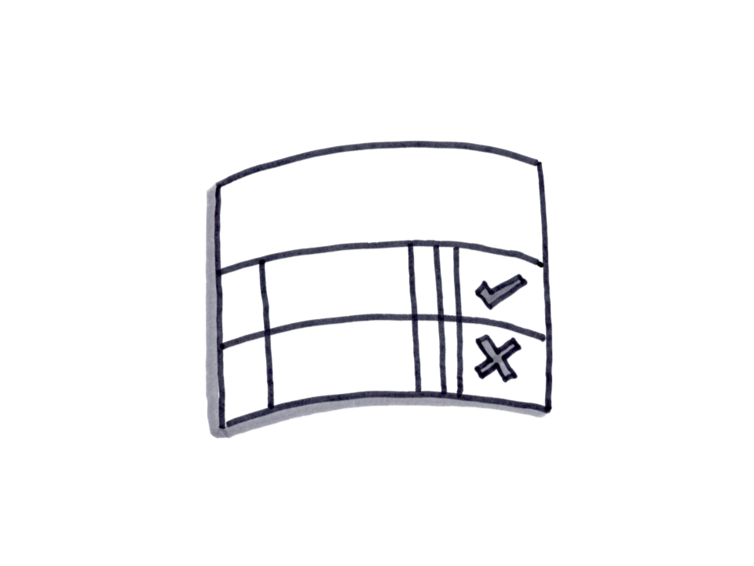

# Scorecards

## Scorecards

### In Brief

A scorecard is an evaluative decision-making or prioritizing shortcut, often done in a spreadsheet. It is a structured way to identify _one_ top choice among a number of options, to help focus your use of resources \(time, money\). It helps achieve a goal one small step at a time. This technique can be useful if there is no clear intuitive priority.

### Helps Answer

* What is the best of a number of options?
* What criteria will help us achieve the best possible outcome?

### Tags

* Evaluative
* Benchmarking
* Decision-making
* Structured
* Quantitative
* Diagnostic

### Description

As a quick and dirty tool, to choose one thing to focus on, scorecards are difficult to beat. It forces you to choose criteria that are important, then to weight each criterion, and finally to multiply or weight each value in order to generate a number that can then be used to rank all options being considered.

This general framework can be applied in many different areas of running a startup or innovation program:

* Justin Wilcox's [SPA analysis](http://customerdevlabs.com/2012/08/23/prioritizing-customer-segments-with-excel/) helps early stage founders prioritize who to interview first by subjectively valuing market size, how much founders think they'll be willing and able to pay, and how easily the founder can access them.
* Rank product ideas or projects worth pursuing: how much potential revenue, how easy it would be to complete, how fast it can be done, how much social impact, etc.
* Use urgency and importance to prioritize a product backlog.
* Identify your [riskiest assumption](https://dkander.wordpress.com/2013/05/07/how-to-diagnose-your-riskiest-assumptions/): uses a scorecard to rank risks via impact and likelihood.
* Prioritize a channel for one of a number of potential marketing channels for channel testing.

The primary goal here is to prevent "analysis paralysis" while still providing one clear priority to make it easier to identify an immediate next step.

#### Time Commitment

15-30 minutes; depends on the number of options to evaluate

#### How To

Ask what are three examples of the best and three of the worst of this thing \(skill, venue, performance, etc.\)? What were the consistent mindsets leading to the three best examples?

1. Make a list of the options you want to consider in the left-hand column
2. Choose criteria that are important in the top row. For example, in Justin's SPA analysis, that would be Market \(S\)ize, Willingness to \(P\)ay, and \(A\)ccessibility for the founder.
3. Weight each criterion. For each option, consider the importance of that criterion. In each column, put in a value from 1-10. For example, in the first data row, put in a value that estimates the market size of potential interviewees. 
4. When you have estimated across all values, multiply out the values of each option in order to generate a summary number per option. In other words, multiple the values for Size, Pay, and Accessibility for each row. This will give you a summary weight for every option.
5. Sort the summary numbers from greatest to smallest, and rank all options being considered. 
6. Identify the top option, and take action. 

#### Interpreting Results

This technique is highly dependent on subjective factors. While it seems "scientific," in fact a lot depends on the weights you assign to each option. Its primary goal is to give you _one_ option to pursue, so that you can execute on it without dwelling on which decision you ought to make. If you take action quickly, you can always change your mind later. However if you don't take action at all, you won't generate a result.

A scorecard may generate a result that is counterintuitive. If that is the case, then most likely the result that you wanted is the "correct" option to pursue. Going through the exercise can help to surface what you already know, but you can't articulate consciously.

#### Potential Biases

As this technique does not gather data, it is purely a subjective ranking tool in order to take action. Even though it looks very considered and rational, it should not be confused with data-backed decision tools. The numbers used are subjective estimates.

#### Field Tips

* "Scorecards get you 'out of the building' and executing, if you lack the intuition to know what to do next." @LaunchTomorrow
* "There can only be one top priority at any given time. Use a scorecard to identify yours." @LaunchTomorrow
* Got a tip? Add a tweetable quote by emailing us: [realbook@kromatic.com](mailto:realbook@kromatic.com)

### Case Studies

* Got a case study? Add a link by emailing us: [realbook@kromatic.com](mailto:realbook@kromatic.com) 

### Tools

* Got a tool to recommend? Add a link by emailing us: [realbook@kromatic.com](mailto:realbook@kromatic.com) 

### References

* [Customer Dev Labs: Prioritizing Customer Segments with Excel](http://customerdevlabs.com/2012/08/23/prioritizing-customer-segments-with-excel/)
* [Diana Kander: How to Diagnose Your Riskiest Assumptions](https://dkander.wordpress.com/2013/05/07/how-to-diagnose-your-riskiest-assumptions/)
* [Sixteen Ventures: Startup Customer Development Hacks](http://sixteenventures.com/startup-customer-development-hacks)
* [Medium - Ipsita Agarwal: Leaning into the Lean Startup Methodology](https://medium.com/@ipsita/leaning-into-the-startup-methodology-b5327ac02d98)
* Got a reference? Add a link by emailing us: [realbook@kromatic.com](https://github.com/trikro/the-real-startup-book/tree/6a17bc36666863334ffdefad4f2a9abf3e12ce13/part7-out-of-the-box/realbook@kromatic.com)

