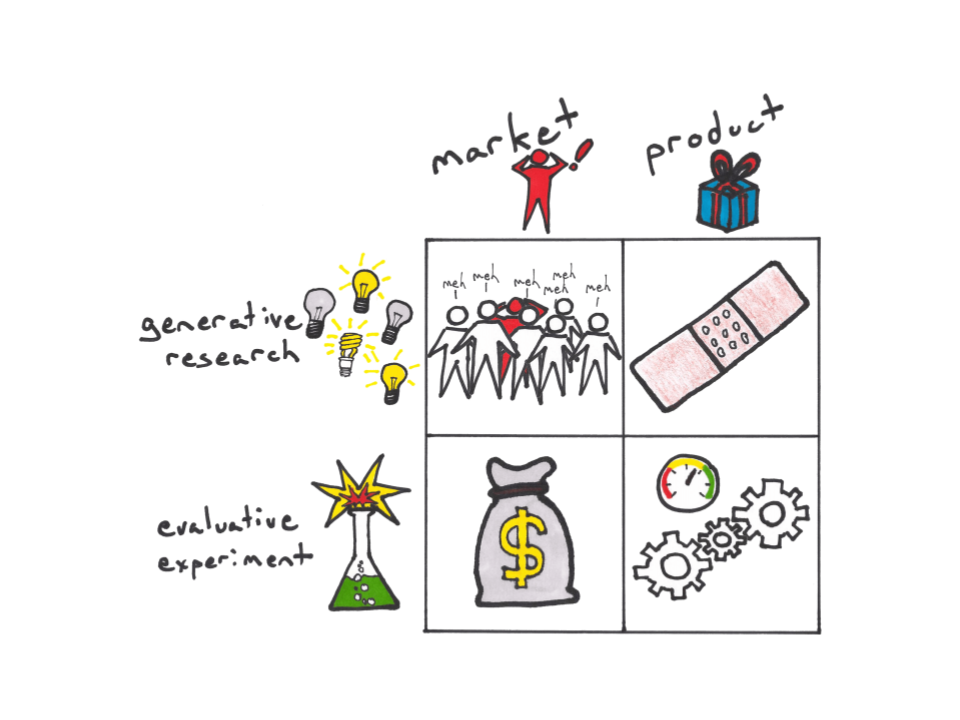

# Index of Methods

## Index of Methods

<table>
  <thead>
    <tr>
      <th style="text-align:left"></th>
      <th style="text-align:left"><b>Market</b>
      </th>
      <th style="text-align:left"><b>Product</b>
      </th>
    </tr>
  </thead>
  <tbody>
    <tr>
      <td style="text-align:left"><b>Generative</b>
      </td>
      <td style="text-align:left">- Customer discovery interviews
         - Contextual inquiry/ethnography
         - Data mining
         - Focus groups*
         - Surveys* (open-ended)</td>
      <td style="text-align:left">- Solution interview
         - Contextual inquiry/ethnography
         - Demo pitch
         - Concierge test/consulting
         - Competitor usability
         - Picnic in the graveyard</td>
    </tr>
    <tr>
      <td style="text-align:left"><b>Evaluative</b>
      </td>
      <td style="text-align:left">
        
- Five-second tests
           - Comprehension testing
           - Data mining/market research
           - Surveys* (closed)
           - Smoke tests (e.g. video, landing page)
           - Sales pitch
           - Pre-sales
           - Flyers
           - Pocket test

        
- Event
           - Fake door

      </td>
      <td style="text-align:left">- Paper prototypes
         - Clickable prototypes
         - Usability
         - Hallway
         - Live
         - Remote
         - Wizard of Oz
         - Takeaway
         - Functioning products
         - Analytics/dashboards
         - Surveys* (e.g. Net promoter score, Product/market fit survey)</td>
    </tr>
  </tbody>
</table>