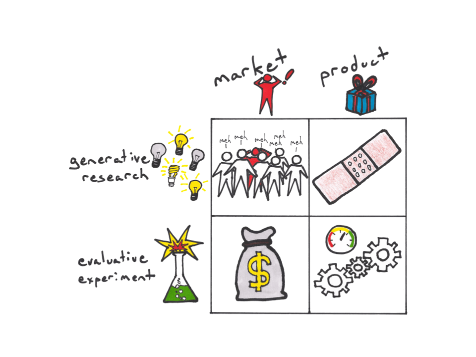

# Index of Questions

## Index of Questions

|  | **Product \(**_**Market**_**\)** | **Solution \(**_**Product**_**\)** |
| :--- | :--- | :--- |
| **Generative** | - Who is our customer?  - What are their pains?  - What job do they need done?  - Is our customer segment too broad?  - How do we find them? | - How can we solve this problem?  - What form should this take?  - How important is the design?  - What’s the quickest solution?  - What is the minimum feature set?  - How should we prioritize? |
| **Evaluative** | - Are they really willing to pay?  - How much will they pay?  - How do we convince them to buy?  - How much will it cost to sell?  - Can we scale marketing? | - Is this solution working?  - Are people using it?  - Which solution is better?  - How should we optimize this?  - What do people like/dislike?  - Why do they do that with our product/service? |

